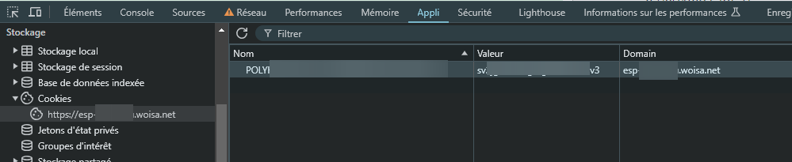
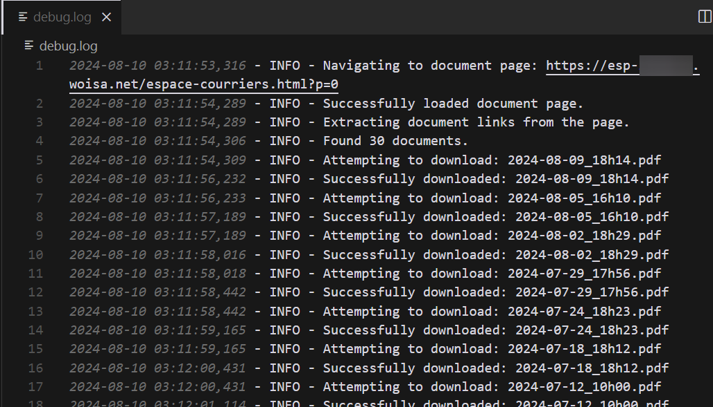

# Scraper de Documents ESP-xxxx

*Read this in [English](README.md)*


---

Ce script Python automatise le processus de téléchargement de documents depuis le portail ESP-xxxx.

xxxx est généralement le nom de la société de domiciliation à laquelle vous avez souscrit.

Pour des raisons de sécurité, vous devrez vous connecter manuellement sur le site web comme d'habitude dans votre navigateur.
Ensuite, trouvez votre cookie de session, collez-le dans le `config.ini` et vous êtes prêt à gagner des heures !

## Prérequis

- Python 3.7 ou supérieur
- pip (installateur de paquets Python)

## Installation

1. Clonez ce dépôt ou téléchargez les fichiers du script.
2. Installez les paquets Python requis :

```bash
pip install requests beautifulsoup4
```

## Configuration

1. Dupliquez le fichier `config.ini.dist` et renommez-le `config.ini`.
2. Ouvrez le fichier `config.ini` et mettez à jour les paramètres suivants :
   - `Cookie` : nom et valeur (voir les instructions ci-dessous)
   - `Scraping` : numéros de page de début et de fin
   - `Paths` : répertoire pour sauvegarder les fichiers téléchargés
   - `URLs` : URL de base et URL de la page de documents

## Obtention du Cookie

Pour utiliser ce script, vous devez fournir un cookie de session valide. Voici comment l'obtenir :

1. Ouvrez Chrome et connectez-vous au portail ESP-xxxx.
2. Une fois connecté, appuyez sur F12 pour ouvrir les Outils de Développement.
3. Allez dans l'onglet "Application".
4. Dans la barre latérale gauche, développez "Cookies" et cliquez sur l'URL ESP-xxxx.
5. Cherchez un cookie nommé `POLYxxxxxxxx` (ou similaire).
6. Copiez la valeur du cookie et collez-la dans le fichier `config.ini`.



## Utilisation

Exécutez le script avec Python :

```bash
python scraper.py
```

Le script va :
1. Lire la configuration depuis `config.ini`
2. Se connecter au portail ESP-xxxx en utilisant le cookie fourni
3. Naviguer à travers les pages spécifiées
4. Télécharger tous les documents disponibles en les renommant avec leur date et heure d'envoi
5. Sauvegarder les documents dans le répertoire spécifié
6. Enregistrer toutes les activités dans `debug.log`

Exemple de sortie du fichier log :



## Dépannage

Si vous rencontrez des problèmes :
1. Vérifiez le fichier `debug.log` pour les messages d'erreur.
2. Assurez-vous que votre cookie est valide et non expiré.
3. Vérifiez que les URLs dans `config.ini` sont correctes.

## Avertissement

Ce script est destiné à un usage personnel uniquement. Assurez-vous que vous avez le droit d'accéder et de télécharger ces documents. Utilisez-le de manière responsable et conformément aux conditions d'utilisation d'ESP-xxxx.


## Contribution

Pour générer de nouveaux GIF :

- `gif_screen_source.png` : capture d'écran source.
- `gif_screen_result.png` : capture d'écran résultat.
- `hero.gif` : le GIF généré.

```python
pip install Pillow imageio
cd img
python gif-generator.py
```