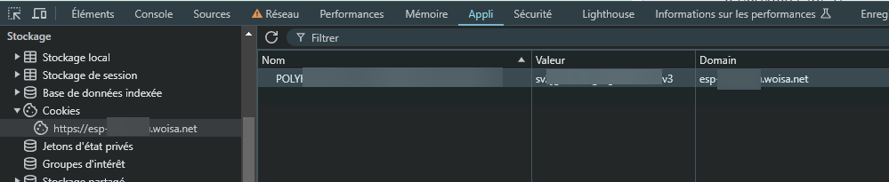

# ESP-xxxx WOISA Document Scraper

*Lire en [français](README.fr.md)*


---

This Python script automates the process of downloading and renaming scanned mails from the ESP-xxxx WOISA portal.

xxxx is usually the name of the domiciliary company you have subscribed to.

For security purpose, you will need to login manually on the website as usual in your browser.
Then, find your session cookie, paste it in the `config.ini` and you are ready to save hours!

## Prerequisites

- Python 3.7 or higher
- pip (Python package installer)

## Installation

1. Clone this repository or download the script files.
2. Install the required Python packages:

```bash
pip install requests beautifulsoup4
```

## Configuration

1. Duplicate `config.ini.dist` and rename it `config.ini`.
2. Open the `config.ini` file and update the following settings:
   - `Cookie`: name and value (see below for instructions)
   - `Scraping`: start and end page numbers
   - `Paths`: directory to save downloaded files
   - `URLs`: base URL and document page URL

## Obtaining the Cookie

To use this script, you need to provide a valid session cookie. Here's how to get it:

1. Open Chrome and log in to the ESP-xxxx portal.
2. Once logged in, press F12 to open Developer Tools.
3. Go to the "Application" tab.
4. In the left sidebar, expand "Cookies" and click on the ESP-xxxx URL.
5. Look for a cookie named `POLYxxxxxxxx` (or similar).
6. Copy the cookie's value and paste it into the `config.ini` file.

Below is a screenshot of the Chrome browser.
The steps are near identical in Microsoft Edge, Firefox, Safari, Brave...



## Usage

Run the script using Python:

```bash
python scraper.py
```

The script will:
1. Read the configuration from `config.ini`
2. Connect to the ESP-xxxx portal using the provided cookie
3. Navigate through the specified pages
4. Download all available documents
5. Save the documents in the specified directory withe the cleaned up upload date and time
6. Log all activities to `debug.log`

Below is a screenshot of the log file.


## Troubleshooting

If you encounter any issues:
1. Check the `debug.log` file for error messages.
2. Ensure your cookie is valid and not expired.
3. Verify that the URLs in `config.ini` are correct.

## Disclaimer

This script is for personal use only. Ensure you have the right to access and download these documents. Use responsibly and in accordance with ESP-xxxx's terms of service.